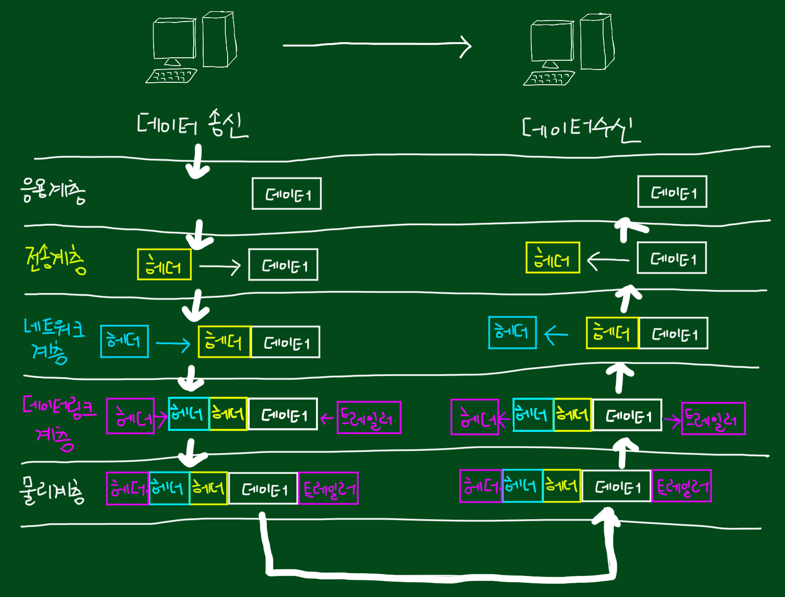

# OSI 7계층

## OSI 7계층이란?

- 네트워크에서 통신이 일어나는 과정을 7단계로 규격화 한 것
- 1984년 국제 표준화 기구(ISO)에서 발표
- Open System InterConnection의 약자
- 물리계층, 데이터링크계층, 네트워크계층, 전송계층, 세션계층, 표현계층, 응용계층 으로 구성
- 통신이 일어나는 과정을 단계별로 파악 가능
- 컴퓨터 통신 구조의 모델과 앞으로 개발된 프로토콜의 표준적인 뼈대를 제공하기 위해 개발된 참조 모델
- 문제 발생시 현상에 따라 원인 파악이 용이해짐
- 복잡한 네트워크 생태계의 표준(규격)을 만듬으로써 서로 다른 통신 업체들 간의 호환이 가능

## 데이터 캡슐화



- 사용자 데이터가 각 계층을 지나면서 하위 계층은 상위 계층으로부터 온 정보를 데이터로 취급하며,   
자신의 계층 특성을 담은 제어정보(주소, 에러 제어 등)를 헤더화 시켜 붙이는 일련의 과정
- 각 계층은 다른 계층과 통신할 때 데이터에 특정 정보가 들어 있는 머리말(헤더)과 꼬리말(푸터)을 추가한 후 다른 계층으로 전달

```markdown
💡 PDU (Protocol Data Unit)   
프로토콜 데이터 단위이며 OSI 모델의 정보 처리 단위
```

## 모듈이 아닌 계층, 계급이라고 표현하는 이유

- OSI 7계층은 상하구조를 가지기 때문이다.
상위 계층의 프로토콜이 정상적으로 동작하기 위해서는 하위의 모든 계층에 문제가 없어야 한다.   
즉 7계층이 정상적으로 작동하기 위해서는 1, 2, 3, 4, 5, 6 계층 모두 정상적으로 작동해야 한다.

```markdown
💡 PC방에서 롤을 하는데 연결이 끊겼다. 어디에 문제가 있는지 확인하기 위해서는   

1. 모든 PC가 문제가 있다면   
라우터의 문제(3계층 네트워크 계층)이거나   
광랜을 제공하는 회사의 회선 문제(1계층 물리 계층)

2. 한 PC만 문제가 있고   
롤 소프트웨어에 문제가 있다면 (7계층 어플리케이션 계층)   
롤 소프트웨어에 문제가 없고, 스위치에 문제가 있으면 (2계층 데이터링크 계층)   
있다고 판단해 다른 계층에 있는 장비나 소프트웨어를 건들이지 않는것이다.
```

# 1. 물리 계층 (Physical Layer)

### **단위**

- Bit
전기가 흐른다 (ON) → 1
흐르지 않는다 (OFF) → 0

### 프로토콜

- 10BASE-T, 100BASE-TX, ISDN, wired, wireless, RS-232, DSL, Twinax

### 특징

- 시스템 끼리 물리적인 연결을 하며 0과 1만으로 이루어진 디지털 시그널(ex.1001001010)을
전압(전기신호)으로 전달하고 반대로 받았다면 전압 파형을 디지털 시그널을 바꾸는 계층
- 데이터 전달 역할만 하고 데이터가 무엇인지, 어떤 에러가 있는지 등에는 신경 쓰지 않음


*CODEC은 랜카드이다.

### 예시

- 전압, 리피터, 허브, 네트워크 어댑터, 중계기 및 케이블 사양, 신호 변경(디지털,아날로그)

## 2. 데이터링크 계층

### **단위**

- Frame

### 프로토콜

- Ethernet, Token Ring, AppleTalk, PPP, ATM, MAC, HDLC, FDDI, LLC, ALOHA

### 특징

- 동일한 네트워크 내에서 단말이 여러대 연결되는 경우 송신한 데이터가 모든 단말로 전달되므로
비효율적일 뿐더러, 보안성에 큰 이슈가 생기고 송수신간 흐름제어도 되지않아 데이터 충돌이 일어날 문제를 해결해주는 계층
- 물리 계층(1계층)을 통해 송수신되는 정보의 오류와 흐름을 관리하여 안전한 정보의 전달을 수행 할 수 있도록 도와주는 계층
- 맥(MAC) 주소를 가지고 통신
- 통신에서의 오류도 찾아주고 재전송 하는 기능을 가지고 있다.
- 계층은 하드웨어 + 소프트웨어 둘다 가지고 있음
- 전송 단위를 프레임이라고 한다.

### 예시

- MAC 주소, 브리지 및 스위치

# 3. 네트워크 계층 (Network Layer)

### **단위**

- Packet

### 프로토콜

- IP, IPX, IPsec, ICMP, ARP, NetBEUI, RIP, BGP, DDP, PLP

### 특징

- 데이터를 목적지까지 가장 안전하고 빠르게 전달하는 기능(라우팅) 계층
- 네트워크 호스트의 논리 주소 지정(ex : ip 주소 사용)을 확인
- 여러 개의 노드를 거칠 때마다 경로를 찾아주는 역할을 하는 계층
- 데이터 스트림을 더 작은 단위로 분할하고 경우에 따라 오류를 감지해 처리
- 전송 계층이 요구하는 서비스 품질을 제공하기 위한 기능적, 절차적 수단을 제공
- 라우팅, 흐름 제어, 세그멘테이션, 오류제어, 인터네트워킹 등을 수행

### 예시

- 라우터

# 4. 전송 계층 (Transport Layer)

### **단위**

- TCP-Segment, UDP-datagram

### 프로토콜

- TCP, UDP, SPX, SCTP, NetBEUI, RTP, ATP, NBP, AEP, OSPF

### 특징

- 데이터를 전송하고, 전송 속도를 조절하며, 오류가 발생된 부분은 다시 맞춰 주는 계층
- 데이터가 제대로 도착했는지 확인, 데이터가 최종적으로 도착할 애플리케이션이 무엇인지 식별
- 하위 계층에 신뢰할 수 있는 데이터 전송 서비스를 제공
- 상위 계층들이 데이터 전달의 유효성이나 효율성을 생각하지 않도록 부담을 덜어줌

### 예시

- 특정 방화벽 및 프록시 서버

# 5. 세션 계층 (Session Layer)

### 단위

- Data

### 프로토콜

- NetBIOS, SAP, SDP, PIPO, SSL, TLS, NWLink, ASP, ADSP, ZIP, DLC

### 특징

- 양 끝단의 응용 프로세스가 통신을 관리하기 위한 방법을 제공   
동시 송수신 방식 (duplex) , 반이중 방식 (half-duplex) , 전이중 방식 (Full Duplex)
- 두 컴퓨터 간의 대화나 세션을 관리 → 포트(PORT) 연결
- 모든 통신 장치 간에 연결을 설정, 관리 및 종료
- TCP/IP 세션 설정, 유지, 종료, 전송 중단시 복구 등의 기능

# 6. 표현 계층 (Presentation Layer)

### **단위**

- Data

### 프로토콜

- ASCII, MPEG, JPEG, MIDI, EBCDIC, XDR, AFP, PAP

### 특징

- 응용 계층으로부터 전송받거나 응용 계층으로 전달해야 할 데이터의 인코딩과 디코팅 역할
- 사용자 시스템에서 데이터의 형식상 차이를 다루는 부담을 응용 계층으로부터 덜어주는 역할
- MIME(Multipurpose Internet Mail Extensions) 인코딩, 암호화, 복호화 등의 동작이 이루어짐   
ex. 유니코드(UTF-8)로 인코딩 되어있는 문서를 ASCII로 인코딩 된 문서로 변환

### 예시

- 인코딩, 디코딩, 암호화, 복호화

# 7. 응용 계층 (Application Layer)

### **단위**

- Data

### 프로토콜

- HTTP, SMTP, SSH, FTP, Telnet, DNS, modbus, SIP, AFP, APPC, MAP

### 특징

- 사용자가 네트워크로 접속하기 위한 모든 인터페이스를 의미
- 사용자(클라이언트) 측의 요청을 전달하기 위해 통신 대상(서버)이 이해할 수 있는   
메시지(데이터)로 변환하고 전송 계층에 전달하는 역할

### 예시

- 텔넷(Telnet), 구글 크롬, 이메일, 파일질라, 데이터베이스 관리

# Reference

[https://losskatsu.github.io/os-kernel/network-basic05/#1-신뢰성](https://losskatsu.github.io/os-kernel/network-basic05/#1-%EC%8B%A0%EB%A2%B0%EC%84%B1)

[https://shlee0882.tistory.com/110](https://shlee0882.tistory.com/110)

[http://wiki.hash.kr/index.php/OSI_7_계층#n](http://wiki.hash.kr/index.php/OSI_7_%EA%B3%84%EC%B8%B5#n)
